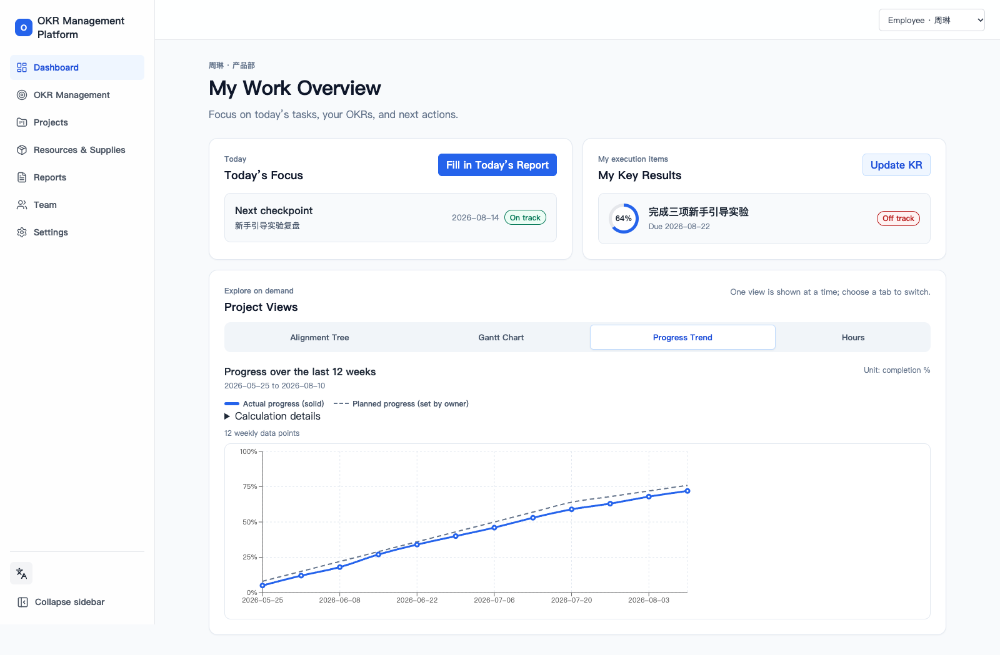
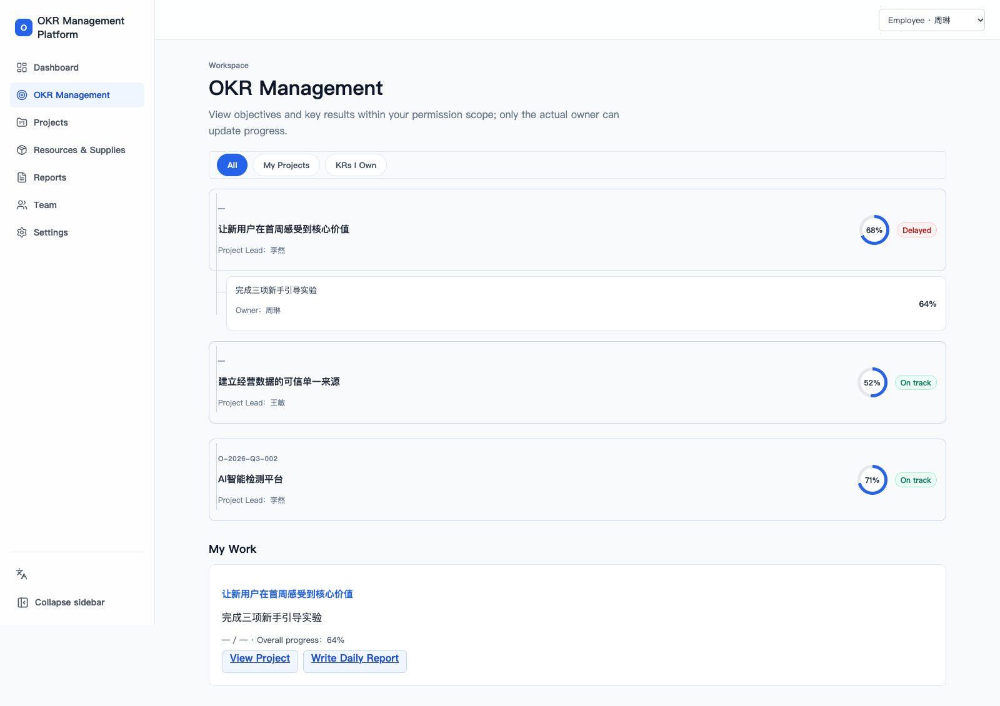
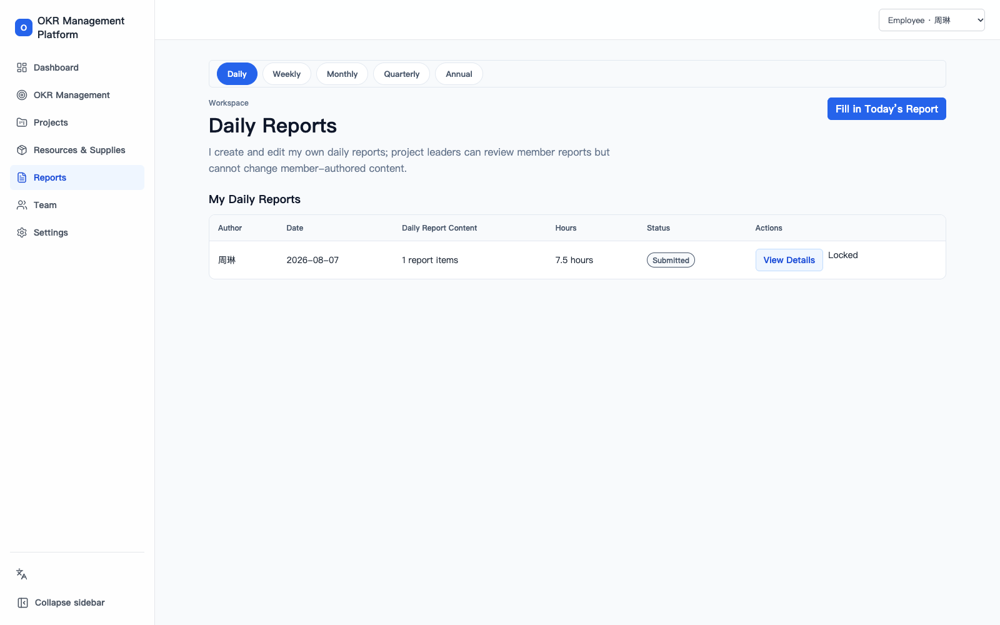

# OKR Management Platform

A role-aware OKR workspace for aligning objectives, tracking key results, coordinating projects, and turning daily execution into structured reports. The interface supports English and Chinese, while the demo mode makes the main workflows available without connecting to production services.

For detailed product guidance, see the [English user guide](docs/user-guide.en.md) or the [Chinese user guide](docs/user-guide.zh-CN.md).

## Screenshots

### Role-based dashboard



### OKR management



### Daily reports



## Key Features

- Role-based dashboards for administrators, management, project leaders, employees, and HR.
- Objective and key-result lifecycle management with ownership, progress history, status, and permission-aware views.
- Project planning views including alignment trees, Gantt charts, progress trends, and recorded work hours.
- Structured daily, weekly, monthly, quarterly, and annual reporting workflows.
- Resource and supply management with attachments and issue tracking.
- HR work-hour review and organization-level user and role administration.
- In-app notifications and instant English/Chinese interface switching.
- Supabase-backed authentication, persistence, restricted RPCs, and row-level security.
- Private attachment transfer through presigned Alibaba Cloud OSS URLs, with attachment metadata retained in PostgreSQL.

## Technology Stack

- React, TypeScript, React Router, and Vite
- Recharts for operational visualizations
- Supabase Auth and PostgreSQL with row-level security
- Express attachment API and Alibaba Cloud OSS
- Vitest and Testing Library

## Local Setup

```bash
npm install
cp .env.example .env.local
npm run dev
```

Open the local URL printed by Vite. The default example configuration uses demo mode and does not require Supabase or OSS credentials.

## Application Modes

Choose one mode in `.env.local`:

```dotenv
# In-memory identities and sample data
VITE_APP_MODE=demo

# Supabase authentication and persistent application data
VITE_APP_MODE=supabase
VITE_SUPABASE_URL=
VITE_SUPABASE_ANON_KEY=
```

`demo` mode keeps its data in the current page session and never uploads files. `supabase` mode requires a valid project URL and publishable/anonymous key. Never expose a service-role key or database password in the frontend environment.

## Security Model

Frontend navigation and controls improve the user experience, but they are not the authorization boundary. In Supabase mode, PostgreSQL row-level security, restricted RPCs, and attachment authorization checks validate every protected read or write. Daily-report content, evidence, and attachments are treated as separately permissioned resources.

Attachment binaries are uploaded directly to private Alibaba Cloud OSS objects through short-lived signed URLs. PostgreSQL stores the application metadata, ownership, object path, state, checksum, media type, and size. The attachment API keeps OSS credentials and the Supabase service-role key on the server only.

## Verification

```bash
npm run verify:config
npm run test:smoke:real
npm run test:run
npm run typecheck
npm run build
```

Database changes can additionally be checked in an isolated local Supabase environment:

```bash
npx supabase db reset
npx supabase test db
npx supabase db lint
```

## Deployment Notes

Create the production frontend with:

```bash
npm run build:production
```

The build reads the standard Vite production environment files, with deployment-injected variables taking precedence, and writes the static application to `dist/`. Serve it as a single-page application and route `/api/attachments` and `/api/resource-attachments` to the separately built attachment API.

The attachment API requires server-only Supabase and OSS configuration, including `SUPABASE_URL`, `SUPABASE_ANON_KEY`, `SUPABASE_SERVICE_ROLE_KEY`, `OSS_ACCESS_KEY_ID`, `OSS_ACCESS_KEY_SECRET`, `OSS_BUCKET`, `OSS_REGION`, and `OSS_ENDPOINT`. Build and run it with:

```bash
npm run server:build
npm run server:start
```

See the [Supabase and deployment guide](docs/supabase-setup.md) for database setup, production checks, backups, and operational procedures.
